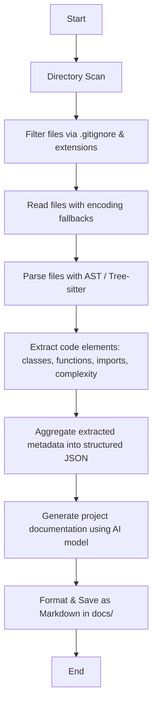

# 🧠 Codara: A Local Codebase Documentation Agent

## Overview

This project is an **offline, local-first AI-powered documentation generator** that scans your codebase, analyzes its structure, and produces high-quality documentation describing the **architecture, technologies, and flow** of the project — without sending your code to any external servers.

It’s designed for developers who need **instant, private insights** into their repositories and want to avoid the overhead of manual documentation.

---

## ✨ Features

- **Offline & Private** – Runs entirely on your local machine. No external API calls unless you explicitly integrate one.
- **Intelligent File Discovery** – Recursively scans your project directory while respecting `.gitignore` rules.
- **Multi-language Parsing** – Uses Python’s `ast` module, Tree-sitter, and custom parsers for accurate code structure extraction.
- **Detailed Code Structure Analysis** – Extracts:
  - Functions, classes, and methods
  - Parameters and decorators
  - Imports and dependencies
  - Cyclomatic complexity estimates
- **Docstring Coverage Metrics** – Identifies undocumented code sections.
- **Concurrent File Processing** – Reads and analyzes multiple files in parallel for speed.
- **JSON Output + Caching** – Deterministic, machine-parsable results with caching to avoid reprocessing unchanged files.
- **Documentation Generation** – Summarizes architecture, technologies, and data flow into a formatted Markdown or text report.

---

## 🛠 How It Works

1. **Directory Scan**  
   The agent traverses the provided project path, filtering files based on `.gitignore` and supported extensions.

2. **File Analysis**  
   Each file is:

   - Read with safe encoding fallbacks
   - Parsed using AST or Tree-sitter
   - Analyzed for functions, classes, methods, imports, and complexity

3. **Data Aggregation**  
   Extracted information is stored in structured JSON format, enabling further automated processing.

4. **Documentation Generation**  
   An AI model processes the aggregated data to produce:

   - A high-level overview of the project
   - Technology stack details
   - Execution flow and architecture notes

5. **Output Formatting**  
   Documentation is saved in `docs/` as Markdown for easy viewing, editing, or publishing.

---

## PROJECT_DOCUMENTATION.md will contain:

    - Summary of the codebase
    - Breakdown of modules and files
    - Key classes, functions, and their roles
    - Flow of execution and data
    - Detected technologies and libraries

## 🔒 Privacy & Security

    - All analysis is performed locally.
    - No files or code leave your machine.
    - Optional LLM integration can be configured to use a local model (e.g., ollama, llama.cpp, GPT4All).

## 🛠 How It Works



## 📦 Installation

```bash
git clone https://github.com/yourusername/yourrepo.git
cd yourrepo
pip install -r requirements.txt
```

```bash
python main.py /path/to/your/codebase
```
